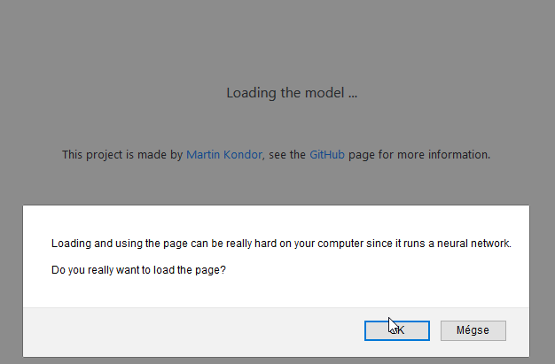

<p align="center"></p>

# SkinCancerDetection

[](https://github.com/MartinKondor/SkinCancerDetection) [](https://github.com/MartinKondor/SkinCancerDetection)  [](https://github.com/MartinKondor/SkinCancerDetection/issues)

Skin cancer detection from browser.

## Getting Started

Encode the trained keras model:

```
tensorflowjs_converter --input_format keras trained/model.h5 trained
```

## Contributing

Ways to contribute:

* Check for open issues
* Read the ```TODO``` file

### Steps

1. Fork this repository
2. Create a new branch (optional)
3. Clone it
4. Make your changes
5. Upload them
6. Make a pull request here

## Authors

* **[Martin Kondor](https://github.com/MartinKondor)**

<p align="center"><a href="https://www.patreon.com/bePatron?u=17006186" data-patreon-widget-type="become-patron-button"></a></p>

## License

Copyright &copy; Martin Kondor 2019

This repository is licensed under the ```BSD 3-Clause``` license.
See the [LICENSE](./LICENSE) file for more details.
